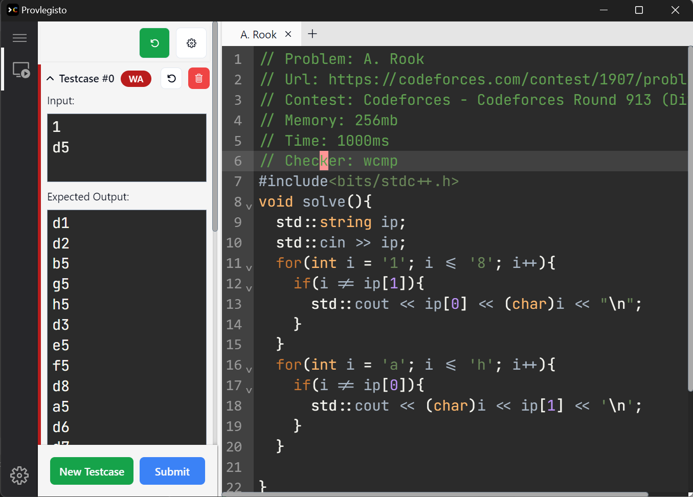

<div>

<table align="center">
<tr>
<td>

</td>
<td>

# Provlegisto

Yet another IDE for competitive programming

**WIP**

</td>
</tr>
</table>
</div>




## Features

- [X] Auto setup enviroment
  + [X] C++
  + [ ] Python
- [X] Coding
- [X] Compile, Run and Check
  + [X] C++
  + [X] Python
- [X] Multi-theme
- [X] Auto-completetion (through LSP)
- [X] Fetch problem from Competitive Companion
- [ ] Sumbit to OJ by button
- [ ] Better keymap

## Developement

Cargo, C++ Compiler and NodeJS are required to build this project.

In addition, according to tauri's requirements, your operation system must statisify the following condition:

| Platform           | Versions                                                                                                        |
| :----------------- | :-------------------------------------------------------------------------------------------------------------- |
| Windows            | 7 and above                                                                                                     |
| macOS              | 10.15 and above                                                                                                 |
| Linux              | webkit2gtk 4.0                                                                                                  |


To compile the project, run below commands in your terminal:

```
$ pnpm install
$ pnpm tauri build
```

The releases file can be found in `src-tauri\target\release\bundle\` folder
 
Also you can run `pnpm tauri dev` to debug the program.

Any pull request are welcomed to this project

