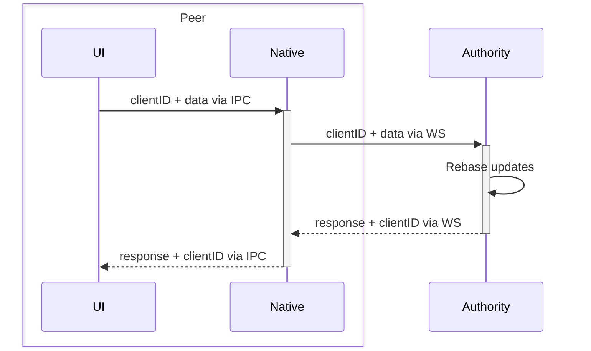
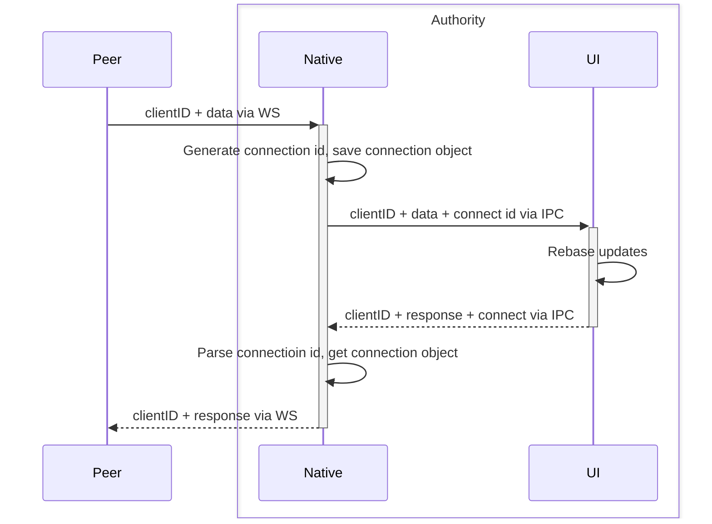

# Collab

This is a temporary implement currently, the server should be move to native implement later

While current all message between are communicate by sending to native through IPC first, then send to authority server after wrapped.

## TX as Peer

## RX as Authority

